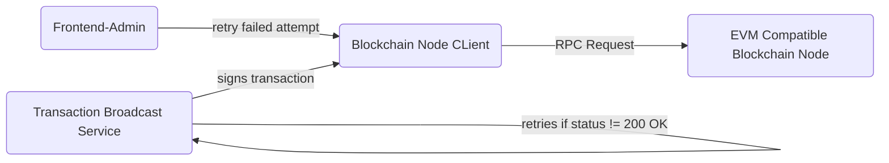

# System Design of API gateway

This design is based upon traditional API best practices and then integrated with some additional  processes to cope with transactions.


## Software Abstraction

- Broadcaster Service : Handles incoming broadcast requests, signs transaction and broadcast them to the Blockchain Node Client and manages retires and error handling
- Blockchain Node Client : Handles communicating with the blockchain node via RPC requests
- Retry Scheduler : Schedules retry attempt based on the exponential backoff strategy
- Transaction Monitor : A separate module to keep track of the status of transactions and allow admin to retry a transaction if it fails

## API Design

A broadcaster service will expose the suite of internal APIs for broadcast requests. The API in this example should accept POST requests with JSON payloads in the body of the request with message_type, data and more.

An example of a POST API would be 
Endpoint '/transaction/broadcast'
Method: POST
Body: 

```json
{  "message_type":  "add_weight(address _addr, uint256 _weight)",  "data":  "0xd71363280000000000000000000000005eb715d601c2f27f83cb554b6b36e047822fb70a00000000000000000000000000000000000000000000000000000000000000fa"  }
```

Upon sending a request, the broadcaster service will process the request and return a status of either:
- HTTP '200' for success, 
- HTTP '4xx-5xx' for errors

## Authentication

To ensure authenticity and integrity of transaction, after receiving the POST request, the broadcast service will sign the transaction using a key generated based on the sender's address that can then be authenticated with the sender's private key.

## Request Flow

After being signed with the sender's key, the broadcast service will send this request to the blockchain node client to make an RPC request to a blockchain node that is EVM compatible. Upon successful handoff to the blockchain node client, the broadcast service should receive a HTTP 200 OK status. The blockchain node client would then wait for a response from the node for the status. If the blockchain node client receives an error status, it will automatically resolve it by retrying seamlessly without the involvement of the broadcaster service.

## Error Handling and Re Attempt

- When the status of the RPC request fails, the broadcast service should automatically retry the broadcast again. this retry attempt should follow the exponential backoff strategy where it makes the request after an exponentially long delay. The maxium number of retries should also be set at a constant number so that there will not be multiple infinitely retrying requests taking up resources.
- With the implementation of a API gateway, it should be able to monitor repeated requests and prevent overloading of the blockchain node. 
- When the transaction fails due to other errors, the broadcaster service should be able to tweak the request and retry the request with the needed changes
- Admin should have a portal that can view and manually retry the transaction with a click of a button

## Visualisation
- The broadcaster service should have a record of all transactions with it's status. The interface should be able to then list the transactions and obtain the details of the transaction and the status of it.
- Admins should have a button to retry a failed transaction

